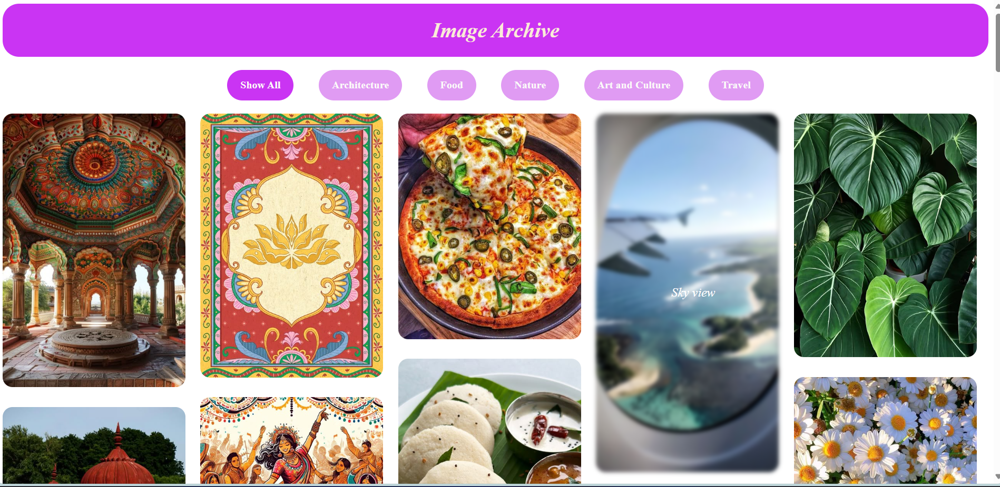

# Responsive Image Gallery

This is a simple responsive image gallery created using **HTML**, **CSS**, and **JavaScript**. The gallery displays a collection of images and allows users to filter them by category, view them in a larger, detailed view, and enjoy interactive hover effects.

## **Features**
- Responsive layout that adapts to different screen sizes.
- Filter images by categories such as Architecture, Food, Nature, Art, and Travel.
- Interactive hover effects that display brief descriptions of the images.

## **Technologies Used**
- **HTML5**: Provides the structure of the gallery.
- **CSS3**: Adds styling, responsiveness, and hover effects.
- **JavaScript**: Implements interactivity, including filtering and modal functionality.

## **How to Use**
1. Clone the repository to your local system:
   ```bash
   git clone https://github.com/priyalrajpara/image_gallery.git
   ```
2. Open the `index.html` file in your browser to view the gallery.
3. Use the filter buttons to display images by category or view all images.
4. Hover over an image to see its description.

## **Folder Structure**
```
image_gallery/
├── index.html       # Main HTML file
├── style.css        # CSS file for styling
├── script.js        # JavaScript file for interactivity
├── photos/          # Folder containing all images
├── LICENSE          # License file
└── README.md        # Project documentation
```

## **Screenshots**


## **License**
This project is licensed under the MIT License. Feel free to use or modify it.

## **Author**
Created by [Priyal Rajpara](https://github.com/priyalrajpara).
